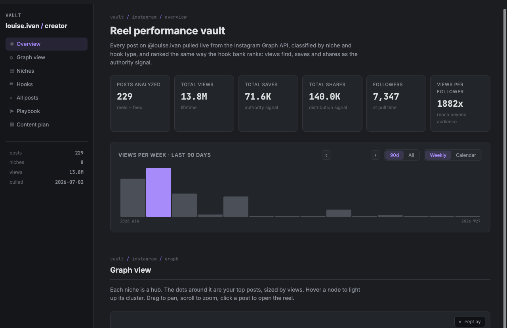
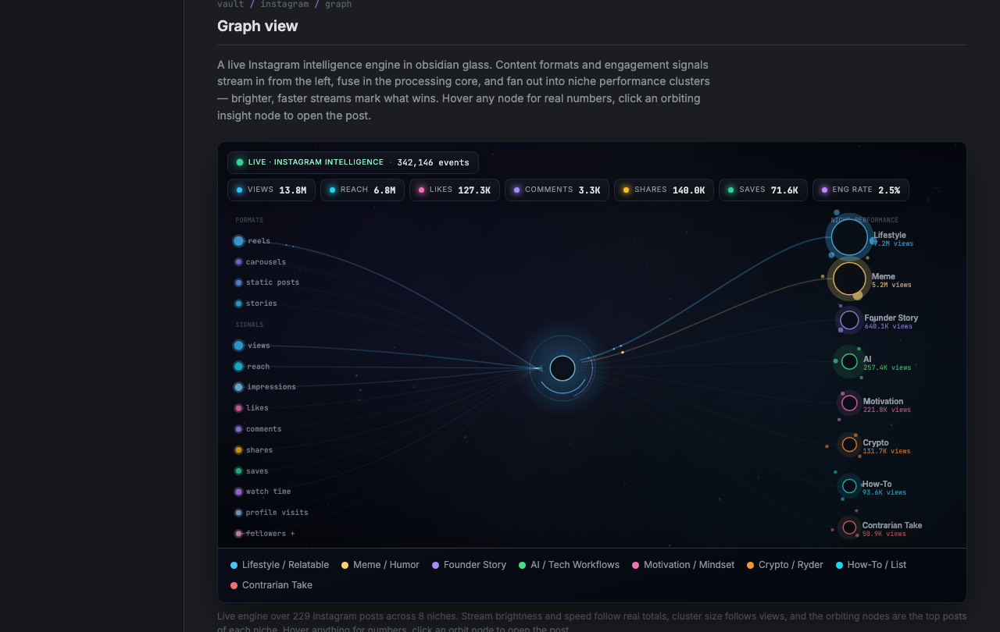
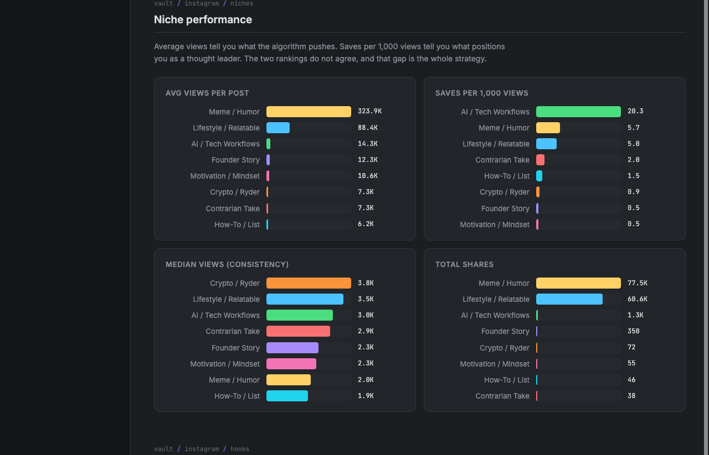
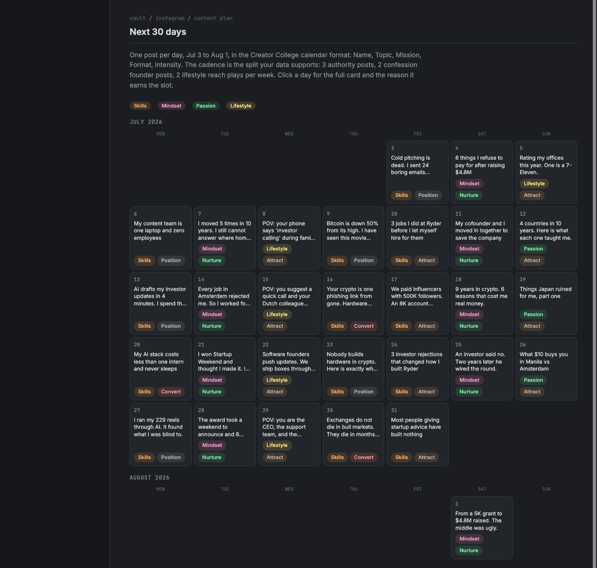

# Creator vault

An Instagram performance dashboard and 30-day content plan, built entirely on top of real data: every post pulled live from the Instagram Graph API, classified into niches and hook types, and ranked by what actually earns saves and shares instead of vanity views.

This is [@louise.ivan](https://www.instagram.com/louise.ivan/)'s vault — 229 posts, 8 niches, 13.8M views. It's also a template. If you're a creator who wants the same dashboard for your own account, everything below shows you how it was built and how to rebuild it with your own numbers.

Static site. No build step, no framework, no dependencies beyond Google Fonts. Open `index.html` and it runs. Live at [louiseivan.github.io/louise-creator-vault](https://louiseivan.github.io/louise-creator-vault/).



## Contents

- [What this is](#what-this-is)
- [Sections](#sections)
- [How the data got here](#how-the-data-got-here)
- [How the 30-day plan got here](#how-the-30-day-plan-got-here)
- [Build your own version](#build-your-own-version)
- [Project structure](#project-structure)
- [Local development](#local-development)
- [Updating the data](#updating-the-data)
- [Updating the content plan](#updating-the-content-plan)
- [Deploying](#deploying)

## What this is

Most creators track growth with a screenshot folder and a gut feeling. This vault replaces both: it pulls your real post history straight from Instagram, forces every post into a niche and a hook-type bucket, and then ranks those buckets two different ways — average views (what the algorithm rewards) and saves per 1,000 views (what actually makes people see you as worth following). The gap between those two rankings is the whole strategy. Whatever wins on views but loses on saves is your reach engine, not your brand. Whatever wins on saves is what you should be doing more of even though it isn't your biggest number.

It's dark, Obsidian-styled, one static HTML file, real data baked into a JS `const`, no backend, no login, no analytics service to pay for. It's the sibling to a dashboard built the same way for [@RyderWallet on X](https://github.com/louiseivan/ryderwallet-vault).

## Sections

**Overview** — stat cards (posts, views, saves, shares, followers, views-per-follower) and a weekly views timeline (all-time by default, 90-day toggle) with a calendar view that heat-shades every day by views.

**Graph view** — a continuous, real-time Instagram intelligence engine in obsidian glass. Content formats (reels, carousels, static posts, stories) and engagement signals (views, reach, impressions, likes, comments, shares, saves, watch time, profile visits, followers) stream in from the left as thin glowing lines. Luminous particles flow through a pulsing processing core and fan out into niche performance clusters on the right, where the small nodes orbiting each cluster are that niche's top three posts.

Everything is weighted by the real numbers: stream brightness, thickness, speed and particle rate follow lifetime totals; cluster size follows views; the halo follows save rate; the top niches gently pulse. A glass HUD pins live status with a ticking events counter and real lifetime totals (views, reach, likes, comments, shares, saves, engagement rate). The animation never stops — no timeline window, no reset point, no loop — with parallax depth, soft camera drift, and a static render for `prefers-reduced-motion`. Hover any source, cluster, or orbit node for the underlying numbers; click an orbit node to open the post; drag to pan, scroll to zoom. Streams without per-post API data (stories, profile visits, impressions, follows) run as dim ambient lines and say so in their tooltips.



**Niches** — average views, saves per 1,000 views, median views (consistency), and total shares, broken out across your niche taxonomy.



**Hooks** — the same ranking, broken out by opening-line style (Contrarian/Hard Truth, POV/Situation, Curiosity Gap, List/Number, and so on), plus a leaderboard of the best-performing individual posts by each metric.

**All posts** — every post, searchable and sortable by any column.

**Playbook** — the strategic synthesis: which niche to double down on, which is reach fuel rather than brand, which is underperforming its importance, and the follower math behind your growth target.

**Content plan** — a 30-day, one-post-a-day calendar. Click any day for the full production card: three hook variations, a spoken script in hook/build/payoff/loop structure, a shot list, on-screen text sequence, a long caption, and a CTA.



## How the data got here

@louise.ivan's posts were pulled from the Instagram Graph API (via [Composio](https://composio.dev), though a direct Meta Graph API call works the same way) using the media insights endpoint, lifetime period:

```
GET /{ig-media-id}/insights?metric=reach,likes,comments,saved,shares,video_view_total_time
GET /{ig-user-id}/media?fields=id,caption,media_type,timestamp,permalink
```

That returns every post with its caption, timestamp, permalink, and per-post reach/likes/comments/saves/shares/watch-time. Reels and feed posts report slightly different metrics — reels don't return per-post follows in the standard insights payload, only in the app's own analytics, so that column mostly reads a dash.

Each post then needs a **niche** (what it's about) and a **hook type** (how it opens). Keyword rules alone tend to dump most posts into one or two generic buckets, which hides the real pattern. Read the captions properly instead — batch them and classify each one against a fixed taxonomy, one pass, not evolving categories as you go. This vault's taxonomy:

**Niches:** AI / Tech Workflows, Contrarian Take, Crypto / Ryder, Founder Story, How-To / List, Lifestyle / Relatable, Meme / Humor, Motivation / Mindset

**Hook types:** Confession/Admission, Contrarian/Hard Truth, Curiosity Gap, List/Number, News/Event, Other, POV/Situation, Visual-Led

A real distribution across every category is the point — if 90% of posts land in one bucket, the taxonomy is too coarse or the classification pass was too lazy, and none of the rankings downstream will mean anything.

## How the 30-day plan got here

The Playbook and content plan aren't generic "post consistently" advice. They come from reading what the data actually says:

- **Views tell you reach, saves tell you authority.** In this vault, Meme/Humor pulls 323.9K average views but only 5.7 saves per 1,000. AI/Tech Workflows pulls a fraction of the views but leads saves at 20.3 per 1,000 — that's the niche that makes people file you away as someone worth coming back to.
- **Views-per-follower** (1882x here) tells you whether reach or conversion is the bottleneck. A number that high means the algorithm is already doing its job; the constraint is turning viewers into followers, which points at the niches with real save/comment behavior, not the highest-view ones.
- **Hook type performance** is graded the same way — a hook that wins on views but not saves is a scroll-stopper, not a positioning tool. Contrarian/Hard Truth openings led saves per 1,000 in this data, which is why they anchor the highest-intensity days in the plan.
- The weekly cadence in the plan (a mix of authority posts, confession-style founder posts, and lower-effort lifestyle reach plays) is set by which mix the data actually supports, not an arbitrary rule like "post once a day, no exceptions."

The plan format follows the Creator College calendar structure: Name, Topic, Mission, Format, Intensity per day, each with a `why` field tying it back to a specific number or pattern above. Full reasoning for each day lives in the `why` field of every entry in `js/plan.js`.

## Build your own version

You don't need to be a developer to run this — you need your own data and about an hour to classify it. Here's the path from zero to your own vault:

**1. Get your post data.** You need a professional (Creator or Business) Instagram account — personal accounts can't use the Graph API. Get an access token through [Meta's Graph API Explorer](https://developers.facebook.com/tools/explorer/) or a service like Composio, then pull your media list and per-post insights (see [How the data got here](#how-the-data-got-here) for the exact endpoints). If you don't want to touch the API directly, Instagram's own "Download your data" export includes captions and timestamps, though you'll be missing per-post saves/shares and will need to backfill those from the app's insights screen post by post.

**2. Decide your niche and hook taxonomy.** Look at 20-30 of your posts and write down the 6-10 topics they actually cluster into — don't guess in advance, read first. Do the same for hook types (how the first line opens: a question, a contrarian claim, a list, a confession, and so on). Keep both lists short enough that no bucket silently becomes "everything else."

**3. Classify every post.** Go through your full post history and tag each one with exactly one niche and one hook type from your fixed lists. This is the part worth doing by hand or with careful LLM batching rather than simple keyword matching — sloppy classification here makes every chart downstream meaningless.

**4. Fork this repo and swap in your data.** Clone it, then replace the contents of `js/data.js` with your own array (see [Updating the data](#updating-the-data) for the exact shape). Update `NICHE_COLORS` in `js/app.js` if your taxonomy has different niche names, and update the `FOLLOWERS` figure and page title/handle in `index.html`.

**5. Read your own Playbook.** Once your real numbers are in, look at what actually wins on saves versus what wins on views — that gap is your strategy, and it will look different from this one. Don't copy the playbook text; write your own conclusions from your own bars.

**6. Write your own 30-day plan.** Use `js/plan.js` as a template for the structure (hooks, script, shots, overlay text, caption, CTA per day), but write content that matches what your data says is working. See [Updating the content plan](#updating-the-content-plan).

**7. Deploy it.** Static files, no server. See [Deploying](#deploying) — Netlify's drag-and-drop is the fastest path if you don't want to touch git at all.

## Project structure

```
index.html        markup for all 7 sections
css/style.css      theme and layout (dark, Obsidian-styled)
js/data.js          your posts, one const, regenerated from the Instagram Graph API
js/plan.js          the 30-day content plan, one const
js/app.js           aggregation, charts, graph engine, table, playbook, plan calendar, nav
netlify.toml        headers config for Netlify
docs/images/        screenshots used in this README
```

No build tooling, no package.json, no framework. Everything is vanilla JS reading from the two data consts.

## Local development

Any static file server works:

```bash
python3 -m http.server 8534
# → http://localhost:8534
```

## Updating the data

1. Get an Instagram Graph API access token for your professional account (see [Build your own version](#build-your-own-version) for how).
2. Re-run the insights requests in [How the data got here](#how-the-data-got-here) for any posts since your last pull.
3. Classify any new posts into your niche/hook taxonomy.
4. Regenerate `js/data.js` as a single array, one object per post:

```json
{"id":"...","cap":"caption text","type":"REELS","ts":"2026-07-02T13:39:34+0000","url":"https://www.instagram.com/reel/...",
 "views":0,"reach":0,"likes":0,"comments":0,"saves":0,"shares":0,"watch":0,
 "niche":"AI / Tech Workflows","hook":"Contrarian/Hard Truth","ok":true,"fol":null}
```

5. Update the `FOLLOWERS` constant and the "pulled" date in `js/app.js` so the follower math and views-per-follower stat stay current.

**Never commit an API token into this repo.** It's a static site with no server, so any key placed in the JS would be public the moment it's deployed.

## Updating the content plan

`js/plan.js` is a plain array, one object per day, with `name`, `topic`, `mission`, `format`, `intensity`, `niche`, `hookType`, `why`, three `hooks` variations, a full `script` (hook/build/payoff/loop), a `shots` list, `overlay` text sequence, `caption`, and `cta`. Once the current 30 days have run, check which days actually beat their niche's baseline in the Niches/Hooks sections before deciding what earns a permanent slot in the next plan — the point of the plan is that it updates itself from real results, not that it's right the first time.

## Deploying

Static files, deploys anywhere:

**Netlify, no git:** [app.netlify.com/drop](https://app.netlify.com/drop), drag the project folder in, live in about 10 seconds.

**Netlify, with git:** push this repo, then Netlify → Add new site → Import an existing project. Build command empty, publish directory `.`.

**GitHub Pages:** this repo deploys from `main` (root) and is live at [louiseivan.github.io/louise-creator-vault](https://louiseivan.github.io/louise-creator-vault/) — pushes to `main` redeploy automatically.

Also works as-is on Vercel or Cloudflare Pages.
